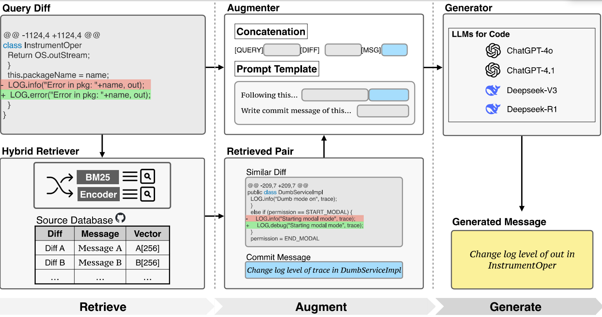

# Replication Package of the Paper: "CoRaCMG: Contextual Retrieval-Augmented Framework for Commit Message Generation"

## Project Overview

This repository contains the replication package for the paper "CoRaCMG: Contextual Retrieval-Augmented Framework for Commit Message Generation". The framework enhances commit message generation by leveraging retrieval-augmented techniques to find similar code commit examples to guide commit message generation.



## Repository Structure
```
├── ApacheCM/                # Apache project commit dataset
│   ├── full.jsonl           # Complete dataset
│   └── test.jsonl           # Test dataset
├── requirements.txt         # Project dependencies
└── scripts/                 # Script files
    ├── CoRaCMG/             # Retrieval-augmented commit message generation module
    │   └── retriever/       # Retrieval module
    │       ├── init .py     # Initialization file
    │       └── embedding.py # Vector embedding and retrieval implementation
    ├── eval.py              # Evaluation script
    ├── metric/              # Evaluation metrics
    │   ├── cider.py         # CIDEr evaluation metric
    │   └── cider_scorer.py  # CIDEr scorer
    └── prompt.py            # Prompt templates and task generation
```

## Environment Setup

Install the required dependencies:

```bash
pip install -r requirements.txt
```
Main dependencies include:

- torch
- pandas
- numpy
- transformers
- scikit-learn
- tqdm
- evaluate
- datasets
## Usage Workflow
### 1. Generate Vector Embeddings
First, use the embedding.py script to generate vector embeddings for code diffs:

```
python scripts/CoRaCMG/retriever/embedding.
py --input_jsonl ApacheCM/full.jsonl 
--output_jsonl ApacheCM/
full_with_embeddings.jsonl
```
This step uses the jinaai/jina-embeddings-v2-base-code model to create vector representations for each code diff and saves the results to the output file.

### 2. Retrieve Similar Examples
Use the retrieval module to find the most similar examples to the target commits:

```
python -m scripts.CoRaCMG.retriever 
--query_jsonl ApacheCM/test.jsonl 
--database_jsonl ApacheCM/
full_with_embeddings.jsonl --output_jsonl 
retrieved_examples.jsonl
```
This step calculates the similarity matrix between query instances and database instances, and retrieves the most similar examples for each query instance.

### 3. Generate Commit Message Tasks
Use the prompt.py script to generate commit message generation tasks:

```
python scripts/prompt.py --dataset_path 
ApacheCM/test.jsonl --tasks_path tasks.
jsonl --prompt_type similar 
--database_path ApacheCM/
full_with_embeddings.jsonl
```
Two prompt types are supported:

- default : Direct prompting without retrieved examples
- similar : Retrieval-based prompting with similar commit examples
### 4. Call LLM API to Generate Commit Messages
Process the generated task file using your chosen large language model API to obtain generated commit messages.

### 5. Evaluate Generated Results
Use the eval.py script to evaluate the quality of generated commit messages:

```
python scripts/eval.py --result_jsonl 
results.jsonl
```
Evaluation metrics include:

- BLEU: Evaluates n-gram overlap between generated and reference texts
- ROUGE-L: Evaluates longest common subsequence
- METEOR: Evaluates alignment between generated and reference texts
- CIDEr: Evaluates consensus between generated and reference texts
## Data Format
### Result Data Format
Evaluation results should be in JSONL format, with each line containing a JSON object with the following fields:

- task_id : Task ID
- model : Model name
- label : Reference commit message
- pred : Generated commit message
## Core Modules
### Retrieval Module (retriever)
- embedding.py : Implements vector embedding and similarity retrieval for code diffs
  - get_embeddings() : Generates vector representations for code diffs using a pretrained model
  - retrieve() : Retrieves the most similar instances based on vector similarity
### Prompt Templates (prompt.py)
- DIRECT_PROMPT : Direct prompt template without retrieved examples
- SIMILAR_PROMPT : Retrieval-based prompt template with similar commit examples
- make_tasks() : Generates commit message generation tasks
### Evaluation Module (eval.py)
- tokenize() : Tokenizer designed specifically for commit messages, handling symbols and camel case
- eval() : Evaluates the quality of generated commit messages using multiple evaluation metrics


